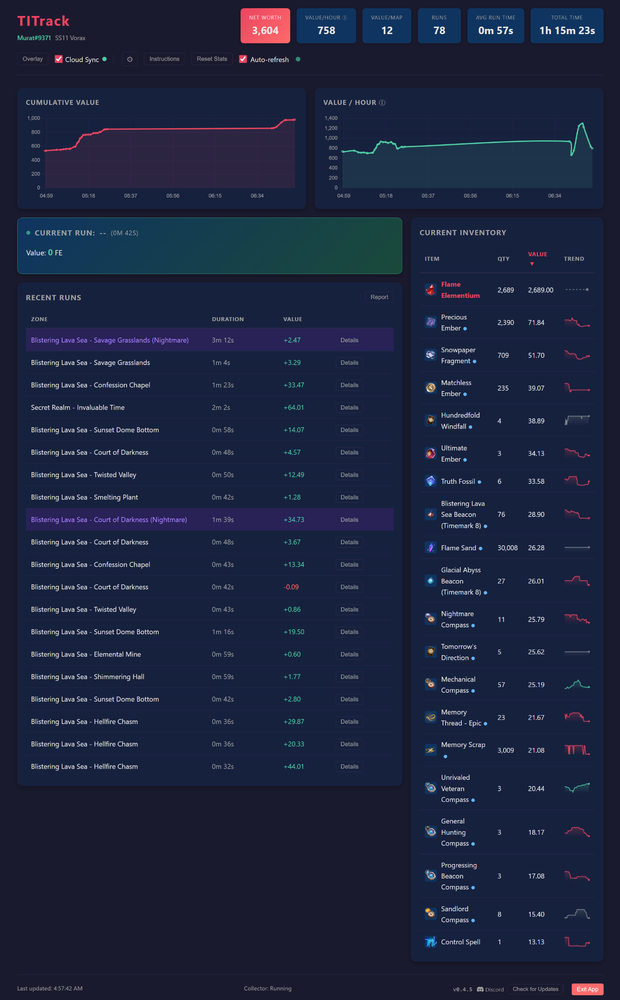
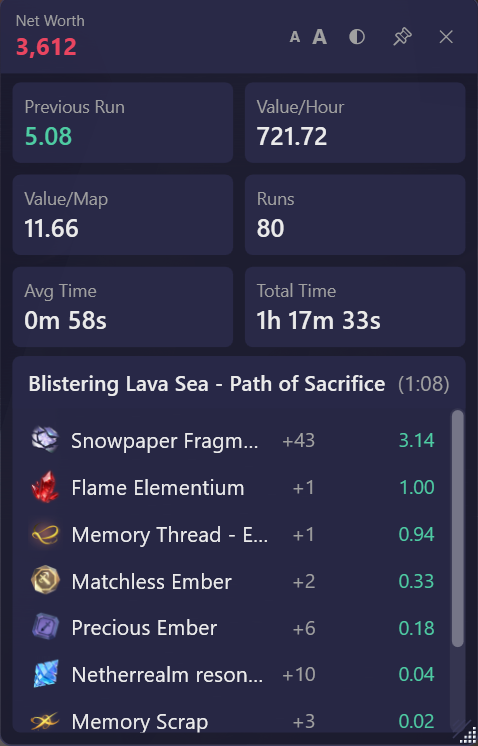

# TITrack — Torchlight Infinite Loot Tracker


**Track your loot. Know your profit. Farm smarter.**

TITrack is a free, privacy-focused Windows desktop app that reads Torchlight Infinite game logs to automatically track every item you pick up, calculate profit per map run, and show your net worth in real time. No cheating, no memory hooks, no cloud account required — just pure log parsing.

Whether you're min-maxing your farming route or just curious how much you're earning per hour, TITrack gives you the data to make better decisions.



### Highlights

- **Fully automatic** — picks up loot events from game logs as you play
- **Profit per map** — see exactly how much each run earns you
- **Net worth tracking** — real-time inventory valuation in Flame Elementium (FE)
- **Always-on-top overlay** — compact transparent overlay for single-monitor setups
- **Price learning** — searches the in-game Exchange to learn item prices automatically
- **Community pricing** — opt-in anonymous cloud sync for crowd-sourced prices
- **100% local** — all data stored on your machine, no account needed
- **Portable** — no installation, just extract and run

Inspired by [WealthyExile](https://github.com/WealthyExile) for Path of Exile.

---

## Quick Start

**No installation required** — TITrack is a portable app. Download, extract, and run.

### Recommended: Use the Setup Tool

1. Go to the [latest release](https://github.com/astockman99/TITrack/releases/latest)
2. Download **`TITrack-Setup.exe`**
3. Run it and choose where to extract (e.g. `C:\TITrack`)
4. Click **Extract**, then **Open Folder**
5. Run **`TITrack.exe`**

> The Setup tool downloads and extracts TITrack programmatically, which avoids the Windows "Mark of the Web" security restrictions that can cause issues with manual ZIP downloads.

<details>
<summary><strong>Alternative: Manual ZIP</strong></summary>

1. Download `TITrack-x.x.x-windows.zip` from the [latest release](https://github.com/astockman99/TITrack/releases/latest)
2. Extract to any folder
3. **Important:** Unblock the files after extracting (see [Windows Security Notes](#windows-security-notes) below)
4. Run `TITrack.exe`

</details>

### First-Time Setup

Once TITrack is running:

1. **Game location** — TITrack auto-detects Steam and standalone installations. If your game is in a non-standard location, it will prompt you to browse for it.
2. **Enable logging** — In-game, open Settings > **Other** tab > click **Enable Log**. TITrack reads these log files to track your loot.
3. **Character detection** — If you've played recently with logging enabled, your character is detected from the existing log. If not detected, switch characters or relog without closing the game — TITrack will pick it up from the new log lines.
3. **Sync your inventory** — Open your bag in-game and click the **Sort** button. This triggers a full inventory snapshot so TITrack knows your current items.
4. **Learn prices** — Search any item on the in-game Exchange. TITrack captures the price automatically and starts valuing that item in all calculations. Or, enable **Cloud Sync** in the dashboard header to download community-sourced prices instantly.

---

## In-Game Overlay

TITrack includes a compact always-on-top overlay window so you can see your stats without alt-tabbing.



- **Launch**: Click "Overlay" in the dashboard, or run `TITrack.exe --overlay`
- **Transparent background** with text drop shadows for visibility over any game scene
- **Click-through** — stats and loot areas pass clicks to the game underneath
- **Live stats**: Net Worth, Value/Hour, Value/Map, Runs, Avg Time, Total Time
- **Current run tracking**: Zone name, duration, and top loot drops sorted by value
- **Previous run preservation**: When a map ends, loot stays visible labeled "Previous Run"
- **Adjustable font size** (A-/A+ buttons, 70%–160%, setting is saved)
- **Pin/unpin** always-on-top, draggable header, resizable corners
- **Compact mode**: Hide loot pickups in Settings for stats-only view

---

## Loot Report

The Report button opens a full breakdown of all loot collected across your runs.


- **Summary stats**: Gross value, map costs, profit, runs, total time, profit/hour, profit/map
- **Doughnut chart** showing top 10 items by value with percentages
- **Full item table**: Icon, name, quantity, unit price, total value, % of total
- **CSV export**: Save the full report to a file for external analysis

---

<details>
<summary><strong>All Features</strong></summary>

### Dashboard

- **Stats header**: Net Worth, Value/Hour, Value/Map, Runs, Avg Run Time, Total Time
- **Interactive charts**: Cumulative Value and rolling Value/Hour over time
- **Current Run panel**: Live drops during active map runs, sorted by value
- **Recent Runs**: Zone, duration, value — click "Details" for full loot breakdown
- **Inventory panel**: Current items sortable by quantity or value
- **Auto-refresh**: Updates every 5 seconds

### Exchange Price Learning

- Automatically captures prices when you search items on the in-game Exchange
- Parses `XchgSearchPrice` messages from game logs
- Calculates reference price (10th percentile of listings)
- Updates inventory valuations and run values automatically

### Cloud Sync (Optional)

- Share and receive community pricing data anonymously
- Toggle on/off in the dashboard header
- Background sync: uploads every 60s, downloads every 5min
- Anti-poisoning: median aggregation requiring 3+ contributors
- Sparkline price trend charts in inventory panel
- Works fully offline with local caching

### Real-Time Tracking (Optional)

- Uses wall-clock time for Value/Hour and Total Time (includes downtime between maps)
- Pause button to exclude breaks from calculations
- Toggle in Settings — default is in-map time only

### Trade Tax

- Toggle in Settings to see after-tax values (12.5% trade house fee)
- Applied to non-FE items only
- Affects run values, net worth, and value/hour

### Map Costs

- Tracks compass/beacon consumption when opening maps
- Subtracts costs from run values to show net profit
- Warning indicator when consumed items have no known price
- Toggle in Settings — default is disabled

### Auto-Update

- Checks for updates on startup
- One-click download and install from within the app

### Multi-Character Support

- Automatically detects character switches
- Inventory, runs, and prices are isolated per character/season
- No manual configuration needed

</details>

<details>
<summary><strong>Windows Security Notes</strong></summary>

Since TITrack is not code-signed, Windows may show security warnings.

### SmartScreen Warning

Click **"More info"** then **"Run anyway"**. This is normal for unsigned applications.

### Mark of the Web (MOTW)

Windows marks files downloaded from the internet as untrusted, which can prevent some DLLs from loading. **Using TITrack-Setup.exe avoids this entirely.**

If you downloaded the ZIP manually, unblock the files after extracting:

```powershell
Get-ChildItem -Path "C:\path\to\TITrack" -Recurse | Unblock-File
```

Or right-click the folder > Properties > check "Unblock" (if available).

> **Note:** Unblocking just the ZIP before extracting is not sufficient — Windows' built-in extractor still marks extracted files. You must unblock after extracting.

If the native window still won't open, the app falls back to browser mode. Check `data\titrack.log` for details.

</details>

<details>
<summary><strong>Settings & Configuration</strong></summary>

### Portable Mode

Keep all data beside the EXE (useful for USB drives):

```
TITrack.exe --portable
```

### Launch Options

| Flag | Description |
|------|-------------|
| `--overlay` | Open dashboard + overlay |
| `--overlay-only` | Open only the overlay (no dashboard window) |
| `--no-window` | Use browser mode instead of native window |
| `--portable` | Store data beside the EXE |
| `--port <N>` | Use a custom port (default: 8000) |

### Settings Modal

Click the gear icon in the dashboard header to configure:

- **Trade Tax** — Show after-tax values (12.5% fee)
- **Map Costs** — Track compass/beacon consumption
- **Real-Time Tracking** — Use wall-clock time for stats
- **Hide Loot Pickups** — Compact overlay mode (stats only)
- **Game Directory** — Change game install location

### Inventory Sync

To capture your full current inventory:

1. Open your bag in-game
2. Click the **Sort** button (auto-organizes items)
3. TITrack captures the full snapshot and updates net worth

Useful when starting for the first time or after inventory gets out of sync.

</details>

<details>
<summary><strong>Development Setup</strong></summary>

> This section is for developers. Regular users should follow the [Quick Start](#quick-start) above.

### Prerequisites

- Python 3.11+
- Windows 10/11
- .NET 8 SDK (for overlay)
- Torchlight Infinite

### Setup

```bash
git clone https://github.com/astockman99/TITrack.git
cd TITrack
pip install -e ".[dev]"
python -m titrack init --seed tlidb_items_seed_en.json
```

### Running in Development

```bash
python -m titrack serve                # Native window (default)
python -m titrack serve --no-window    # Browser mode for debugging
python -m titrack serve --port 8080    # Custom port
```

### Building

```bash
# Build WPF overlay (requires .NET 8 SDK)
dotnet publish overlay/TITrackOverlay.csproj -c Release -o overlay/publish

# Build main application
pip install pyinstaller
pyinstaller ti_tracker.spec --noconfirm

# Copy overlay to dist (PyInstaller may not include large files reliably)
cp overlay/publish/TITrackOverlay.exe dist/TITrack/
```

Output is in `dist/TITrack/`.

### Tests

```bash
pytest tests/              # Run all tests (~137 tests, ~3 seconds)
pytest tests/ -v           # Verbose output
pytest tests/ --cov=titrack --cov-report=html   # With coverage
```

### Code Quality

```bash
black .
ruff check .
```

</details>

<details>
<summary><strong>Architecture</strong></summary>

### Data Flow

```
Game Log File (UE_game.log)
        |
        v
  +-----------+
  | Log Tailer |  <-- Incremental reading, handles log rotation
  +-----------+
        |
   +---------+-----------+
   v                     v
+-----------+   +-----------------+
| Log Parser|   | Exchange Parser |
| (events)  |   | (prices)        |
+-----------+   +-----------------+
   |                     |
   +----------+----------+
              v
        +-----------+
        | Collector |  <-- Orchestration
        +-----------+
              |
    +---------+---------+
    v         v         v
 +-------+ +-----+ +-------+
 | Delta | | Run | | Price |
 | Calc  | | Seg | | Store |
 +-------+ +-----+ +-------+
    |         |         |
    +---------+---------+
              v
        +---------+
        | SQLite  |
        +---------+
              |
              v
        +---------+     +----------+
        | FastAPI | <-- | WPF      |
        | + Web UI|     | Overlay  |
        +---------+     +----------+
```

### Key Concepts

| Concept | Description |
|---------|-------------|
| **FE** (Flame Elementium) | Primary currency, ConfigBaseId `100300` |
| **ConfigBaseId** | Integer item type identifier from game logs |
| **Delta** | Change in quantity (current - previous) for a slot |
| **Run Value** | FE gained + sum(item qty x item price) for priced items |
| **Reference Price** | 10th percentile of exchange listings |
| **Slot State** | Current inventory tracked per (PageId, SlotId) |

### Project Structure

```
TITrack/
├── src/titrack/
│   ├── api/                    # FastAPI backend
│   │   ├── app.py              # App factory
│   │   ├── schemas.py          # Pydantic models
│   │   └── routes/             # API endpoints
│   ├── web/static/             # Dashboard frontend (HTML/JS/CSS)
│   ├── core/                   # Domain logic
│   ├── parser/                 # Log parsing
│   ├── sync/                   # Cloud sync module
│   ├── updater/                # Auto-update system
│   ├── db/                     # SQLite layer
│   ├── collector/              # Main collection loop
│   └── cli/                    # CLI commands
├── overlay/                    # WPF overlay (.NET 8)
├── setup/                      # Setup.exe (portable extractor)
├── tests/                      # ~137 tests
├── pyproject.toml
└── tlidb_items_seed_en.json    # 1,811 item definitions
```

</details>

<details>
<summary><strong>API Reference</strong></summary>

| Endpoint | Description |
|----------|-------------|
| `GET /api/status` | Server status and counts |
| `GET /api/runs` | List runs with values and loot |
| `GET /api/runs/{id}` | Single run details |
| `GET /api/runs/active` | Currently active run with live drops |
| `GET /api/runs/stats` | Aggregated statistics |
| `GET /api/runs/report` | Cumulative loot report |
| `GET /api/runs/report/csv` | Export loot report as CSV |
| `POST /api/runs/pause` | Toggle realtime tracking pause |
| `POST /api/runs/reset` | Clear all run tracking data |
| `GET /api/inventory` | Current inventory state |
| `GET /api/items` | Item database (with search) |
| `GET /api/prices` | Learned prices |
| `PUT /api/prices/{id}` | Update a price |
| `GET /api/prices/export` | Export prices as JSON |
| `GET /api/stats/history` | Time-series data for charts |
| `GET /api/stats/zones` | All encountered zones |
| `GET /api/player` | Current character info |
| `GET /api/cloud/status` | Cloud sync status |
| `POST /api/cloud/toggle` | Enable/disable cloud sync |
| `POST /api/cloud/sync` | Trigger manual sync |
| `GET /api/cloud/prices` | Cached community prices |
| `GET /api/cloud/prices/{id}/history` | Price history for sparklines |
| `GET /api/update/status` | Version and update info |
| `POST /api/update/check` | Check for updates |
| `POST /api/update/download` | Download available update |
| `POST /api/update/install` | Install and restart |
| `GET /api/settings/{key}` | Get a setting value |
| `PUT /api/settings/{key}` | Update a setting |

</details>

<details>
<summary><strong>Design Principles</strong></summary>

1. **Privacy first** — all data stored locally by default, no accounts
2. **No cheating** — only reads log files, no memory hooks or injection
3. **Passive price learning** — prices learned from your own exchange searches
4. **Pure domain logic** — core has no I/O dependencies, easy to test
5. **Incremental processing** — resumes from last position, handles log rotation
6. **Opt-in cloud** — cloud sync is optional, anonymous, and transparent

</details>

<details>
<summary><strong>Contributing</strong></summary>

Contributions welcome! Please:

1. Run tests before submitting PRs (`pytest tests/`)
2. Follow existing code style (`black .`, `ruff check .`)
3. Add tests for new functionality

</details>

---

## License

MIT License — see [LICENSE](LICENSE) for details.
